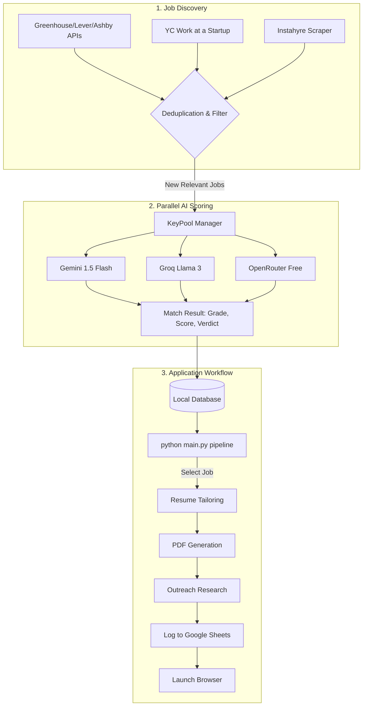

# 🎯 JobHunt: AI-Powered Career Pipeline

JobHunt is a personal automation pipeline designed to eliminate the friction of modern job searching. It programmatically scans job portals, scores your fit with deep AI reasoning, and generates hyper-personalized application packages in seconds.

## 🚀 Key Features

- **Parallel Multi-Key Scoring**: High-performance scoring using a pool of multiple API keys (Gemini, Groq, OpenRouter) with automatic rotation and rate-limit handling.
- **YC Startup Discovery**: Specialized scraper for the **Work at a Startup** (YCombinator) job board and a curated list of top YC startups.
- **Indian Portal Support**: Automated scraping for Indian platforms like **Instahyre** with role and location-based targeting.
- **Department-Aware Scanning**: Target roles in `engineering`, `data`, `product`, `design`, `sales`, or `marketing`.
- **Rich AI Scoring**: Every job gets a **Letter Grade (A-F)**, a numerical score, a "Top Project" recommendation, and a "Match Verdict".
- **Master Application Workflow**: Tailor CV -> Generate PDF -> Find Outreach Targets -> Log to Sheets -> Open Browser.
- **Jake's Resume PDF**: Generates professional, single-column LaTeX-style resumes (HTML/CSS -> PDF via Playwright).
- **Outreach Research**: Identifies specific hiring managers and writes personalized LinkedIn/Email messages.
- **Visual Application Tracker**: Logs everything to a professional Google Sheet with color-coded status badges and grades.

## 📋 Requirements
- **Python 3.10+**
- **Git**
- **Playwright** (for PDF generation and web scraping)
- **API Keys**: Gemini (primary), Groq, or OpenRouter (optional for parallel speedup)

## 🛠️ Quick Start

### 1. Setup Environment
```powershell
git clone https://github.com/imHardik1606/JobHunt.git
cd JobHunt
python -m venv venv
.\venv\Scripts\activate
pip install -r requirements.txt
playwright install chromium
```

### 2. Configure
1. Create `cv.md` in the root and paste your full CV in Markdown.
2. Copy `.env.example` to `.env` and add your keys.
   - **Pro Tip**: Add multiple keys like `GEMINI_API_KEY_1`, `GEMINI_API_KEY_2`, `GROQ_API_KEY_1` to enable high-speed parallel scoring.
3. Update `config.py` with the companies you want to monitor.
4. Run `python main.py sheets_setup` for Google Sheets tracking instructions.

### 3. Run the Pipeline
```powershell
# Scan for Engineering roles in India, including YC companies
python main.py scan engineering india yc

# View your ranked matches and launch applications
python main.py pipeline

# Or apply directly to a specific job ID
python main.py apply {job_id}
```

## 🕹️ Commands

### 🔍 Find Jobs
| Command | What it does | Example |
|---|---|---|
| `scan` | Scan portals by dept + level + location | `python main.py scan engineering fresher yc` |
| `internships` | YC + WaaS internships only | `python main.py internships india` |
| `pipeline` | View ranked scored matches | `python main.py pipeline 7` |

### 📨 Apply
| Command | What it does | Example |
|---|---|---|
| `apply` | Full apply workflow | `python main.py apply 3` |
| `outreach` | Standalone outreach research | `python main.py outreach "Razorpay Backend"` |

### 📊 Track
| Command | What it does | Example |
|---|---|---|
| `status` | Pipeline stats | `python main.py status` |
| `sheets_setup` | Google Sheets setup guide | `python main.py sheets_setup` |

### Scan Flags
A table showing all available flags that can be combined:

| Flag | Options | Default | Example |
|---|---|---|---|
| Department | engineering, data, product, design, sales, marketing | engineering | `scan data` |
| Experience | fresher, intern, junior, mid, senior, any | fresher | `scan engineering intern` |
| Location | india, remote | none (all) | `scan engineering india` |
| Portal | yc | off | `scan engineering yc` |

### 💡 Example Combinations
- `python main.py scan engineering fresher yc`
- `python main.py scan engineering intern india yc`
- `python main.py scan data fresher remote`
- `python main.py internships india`
- `python main.py scan engineering any`

## 🔄 Workflow



## 🏗️ Architecture

### High-Speed Scoring Engine
JobHunt uses a **KeyPool** architecture to distribute scoring tasks across multiple AI models:
- **Parallel Workers**: Automatically calculates the optimal number of workers based on your available API keys.
- **Failover Logic**: If Gemini hits a rate limit, the system automatically rotates to Groq or another Gemini key.
- **Model Support**: `gemini-1.5-flash`, `llama3-8b` (via Groq), and `openrouter/free` meta-models.

### Discovery Pipeline
The discovery engine combines direct portal API calls with browser-based scraping:
- **Direct**: Greenhouse, Lever, and Ashby APIs for 100+ top companies.
- **Scraped**: YCombinator (Work at a Startup) and Instahyre via Playwright.
- **Deduplication**: Automatic global deduplication by URL across all sources.

## 🤝 Customization
To monitor a new company, add it to `COMPANIES` in `config.py`:
```python
{"name": "Anthropic", "portal": "greenhouse", "id": "anthropic"}
```
Support portals: `greenhouse`, `lever`, `ashby`.

## 💰 Cost
- **Job Discovery**: ₹0 (Public APIs & Playwright)
- **AI Scoring**: ₹0 (Gemini/Groq/OpenRouter Free Tiers)
- **Resume PDF**: ₹0 (Playwright)
- **Total**: **₹0**

> [!IMPORTANT]
> The parallel scoring engine is extremely fast. Ensure you have enough API keys in `.env` to sustain high worker counts.

## Project Summary
JobHunt is a high-performance automation engine designed to eliminate the manual grind of job seeking. It doesn't just find jobs; it acts as a full-stack career assistant by:
* Automated Discovery: Real-time scanning of YC (Work at a Startup), Instahyre, Greenhouse, Lever, and Ashby.
* Deep AI Reasoning: Using a parallelized "KeyPool" (Gemini, Groq, OpenRouter) to grade your fit (A-F) against your Markdown CV.
* Surgical Tailoring: Generating hyper-personalized, single-column LaTeX-style resumes (Jake's Template) via HTML/CSS & Playwright.
* Outreach Intelligence: Identifying hiring managers and generating personalized LinkedIn/Email templates.
* Centralized Tracking: Automatically logging every application to a color-coded Google Sheets dashboard.